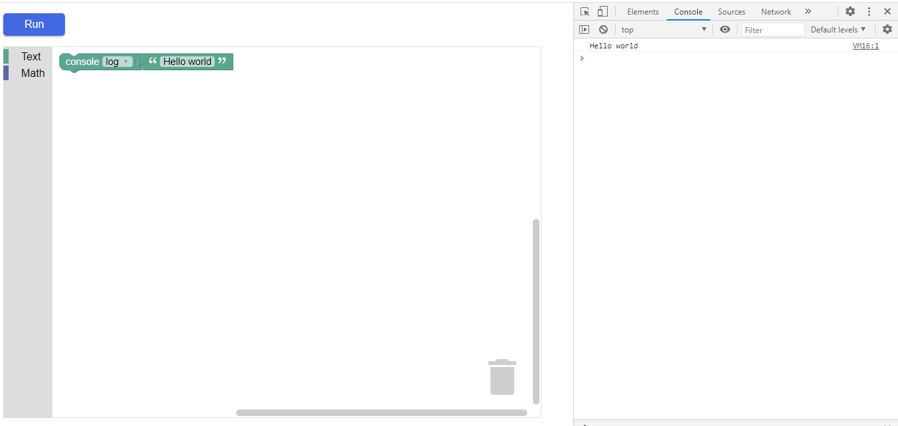

# Blockly Custom Block

This repository shows an example of how to use your [custom block](https://developers.google.com/blockly/guides/create-custom-blocks/overview) made with [Blockly Developer Tools](https://blockly-demo.appspot.com/static/demos/blockfactory/index.html). If you wish to edit the custom block created here, access https://blockly-demo.appspot.com/static/demos/blockfactory/index.html#pe5kp5 .

## About Blockly
[Blockly](https://developers.google.com/blockly) is a client-side library for the programming language JavaScript for creating block-based visual programming languages and editors. A project of Google, it is free and open-source software released under the Apache License 2.0. It typically runs in a web browser, and visually resembles the language Scratch. [Wikipedia](https://en.wikipedia.org/wiki/Blockly)

## Live demo

A live demo can be found at https://rafaeltmbr.github.io/blockly-custom-block/

